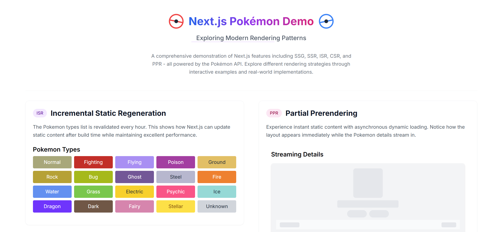

# Next.js Rendering Patterns Demo

[](https://nextjs.org/)
[](https://opensource.org/licenses/MIT)

A demonstration of various Next.js rendering patterns and modern web development techniques using the Pokémon API.



## Features

- **SSG (Static Site Generation)** - Pre-rendered static content
- **SSR (Server-Side Rendering)** - Dynamic server-rendered components
- **ISR (Incremental Static Regeneration)** - Periodically updated static content
- **CSR (Client-Side Rendering)** - Interactive client-side features
- **PPR (Partial Prerendering)** - Hybrid static/dynamic rendering (experimental)
- Advanced caching strategies (localStorage, Map API)
- Auto-suggest functionality with debouncing
- Responsive UI with Tailwind CSS
- Type-safe implementation with TypeScript

## Project Structure

```bash
Nextjs-rendering/
├── 📁 .vscode
│   └── tasks.json          # VSCode workspace configurations
├── 📁 app
│   ├── favicon.ico         # Application favicon
│   ├── globals.css         # Global CSS styles
│   ├── layout.tsx          # Root layout component
│   ├── loading.tsx         # Loading skeleton component
│   └── page.tsx            # Main page component
├── 📁 components
│   ├── 📁 ui
│   │   └── button.tsx      # Reusable button component
│   ├── Header.tsx          # Animated header component
│   ├── PokemonDetails.tsx  # PPR demonstration component
│   ├── PokemonSearch.tsx   # CSR demonstration component
│   ├── PokemonTypes.tsx    # ISR demonstration component
│   └── RandomPokemon.tsx   # SSR demonstration component
├── 📁 lib
│   ├── typeColors.tsx      # Pokémon type color mappings
│   └── utils.ts            # Utility functions
├── 📁 public               # Static assets
└── 📁 types
    └── pokemon.tsx         # TypeScript type definitions
```

## Getting Started

### Prerequisites

- Node.js 18+
- npm 9+

### Installation

1. Clone the repository:

```bash
git clone https://github.com/your-username/nextjs-rendering-patterns.git
```

2. Install dependencies:

```bash
cd nextjs-rendering-patterns
npm install
```

3. Run the development server:

```bash
npm run dev
```

Open [http://localhost:3000](http://localhost:3000) in your browser to view the application.

## Key Technologies

- **Next.js 14** - App Router and React Server Components
- **React 18** - Concurrent features and Suspense
- **TypeScript** - Type-safe development
- **Tailwind CSS** - Modern utility-first styling
- **Axios** - HTTP client for API requests
- **PPR (Experimental)** - Partial Prerendering

## Rendering Patterns Explained

### 1. Static Site Generation (SSG)

- **Component**: `Header`
- Pre-rendered at build time
- Ideal for static content that doesn't change frequently

### 2. Server-Side Rendering (SSR)

- **Component**: `RandomPokemon`
- Fetches fresh data on each request
- Opts out of caching using `unstable_noStore`

### 3. Incremental Static Regeneration (ISR)

- **Component**: `PokemonTypes`
- Revalidates data every hour
- Mixes static generation with periodic updates

### 4. Client-Side Rendering (CSR)

- **Component**: `PokemonSearch`
- Features:
  - Client-side caching with Map API
  - localStorage persistence
  - Debounced search inputs
  - Auto-suggest functionality

### 5. Partial Prerendering (PPR)

- **Component**: `PokemonDetails`
- Experimental Next.js feature
- Instantly displays static shell while loading dynamic content
- Uses React Suspense for streaming

## Contributing

Contributions are welcome! Please follow these steps:

1. Fork the project
2. Create your feature branch (`git checkout -b feature/AmazingFeature`)
3. Commit your changes (`git commit -m 'Add some AmazingFeature'`)
4. Push to the branch (`git push origin feature/AmazingFeature`)
5. Open a Pull Request

## License

Distributed under the MIT License. See `LICENSE` for more information.

This README includes:

1. Clear project overview and features
2. Visual file structure representation
3. Installation and usage instructions
4. Technology stack details
5. Explanation of rendering patterns with component mappings
6. Contribution guidelines and license information

You may want to:

1. Add actual screenshot to `/public` folder
2. Update repository URL in installation instructions
3. Add additional badges for CI/CD or other services
4. Include environment variables if needed
5. Add API documentation links for Pokémon API
